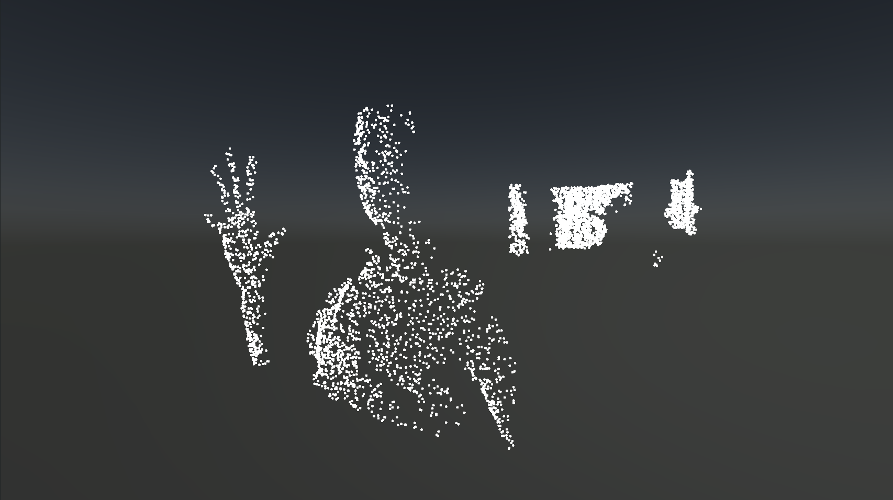

# holopointer
A quick and easy kinect-to-pointcloud converter for MacOS/Swift/Cocoa.

Holopointer also records .usdc sequences of the point clouds so that they can be imported into DCCs like Houdini or Nuke for further use.

## Compiling

Prerequisites:
* XCode
* CMake (for USD build)
* Python

Before compiling the project in XCode, you'll first need to go to the project folder in Terminal and run the build_usd_monolithic.py script. This is so that I don't have to keep dragging an once-a-month-obsolete version of USD along with the project. If you're having trouble compiling it, I can make an archive of the app available, just drop me a message.

## Why?

It's cool I guess.

## Contents

Under holopointer/libusb-1.0 is a version of libusb that happens to work with the Kinects. This is included as a precompiled library for convenience. It's probably veeeeery old. Also, under holopointer/kinect is a slightly modified version of libfreenect's kinect component. There's a couple of new methods to make alloc/dealloc possible through Swift. Both of these are pulled almost as-is from the cocoaKinect project.

## Importing into other apps

Here's a simple combination of ReadGeo and Scanline to display the usdc sequence in Nuke:

In the ReadGeo node, point to one of the .usdc files and change the frame number (e.g. .0001) to #### (e.g. out.####.usdc)

You should get a friendly-sized point cloud in the viewport which can be easily used for rendering or particle emitting or whatever.

